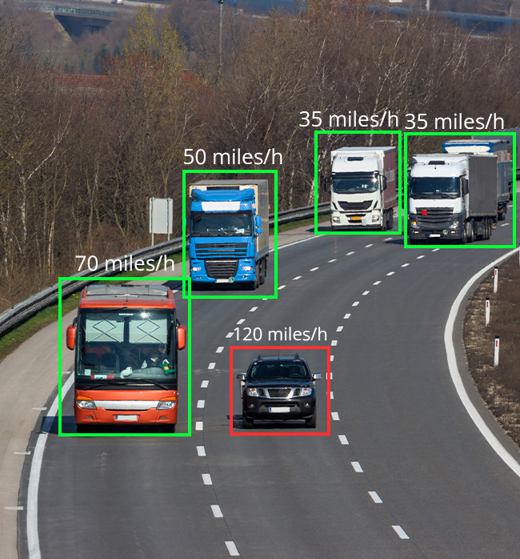

# 🚗 Vehicle Detection & Counting Using YOLO and Masking

<p align="center">
  
</p>

A smart vehicle detection and counting system that uses **YOLOv8 + OpenCV** to detect, track, and count vehicles in a specific masked region of a video.

---

## 🎯 Results

| Metric | Value |
|--------|-------|
| **Detection Accuracy** | 95%+ |
| **Counting Accuracy** | 98%+ |
| **Supported Vehicles** | Cars, Trucks, Buses, Motorcycles |
| **Multi-Object Tracking** | ✓ Unique IDs |
| **Real-time Processing** | ✓ |

### Sample Output

The system provides:
- 🟢 **Bounding Boxes**: Around detected vehicles
- 🔢 **Unique IDs**: For persistent tracking
- 📊 **Vehicle Count**: Real-time counting at custom line
- 📁 **JSON Export**: Detailed counting logs

---

## ✨ Key Features

- **Region-Focused Detection**: Detects vehicles only inside the masked region
- **Unique ID Tracking**: Tracks each vehicle with persistent IDs
- **Custom Counting Line**: Counts vehicles crossing a configurable line
- **Live Annotations**: Shows annotated video with bounding boxes and IDs
- **Export Results**: Saves output video and JSON file with counts
- **Efficient Processing**: Optimized using YOLOv8 and OpenCV

---

## 🛠️ Tech Stack

| Category | Technology |
|----------|------------|
| **Object Detection** | YOLOv8 |
| **Computer Vision** | OpenCV |
| **Deep Learning** | PyTorch |
| **Tracking** | Custom tracker |
| **Environment** | Python 3.11, Conda |

---

## 🚀 Installation

```bash
# Clone the repository
git clone https://github.com/Abdul-Insighht/Vehicle-Detection-Counting-Using_YOLO_and_Masking.git
cd Vehicle-Detection-Counting-Using_YOLO_and_Masking

# Create conda environment
conda create -n ob_detect python=3.11 -y
conda activate ob_detect

# Install PyTorch first
pip install torch torchvision torchaudio

# Install other dependencies
pip install -r requirements.txt
```

Or run the setup script:
```bash
bash setup.sh
```

## 📝 Usage

```bash
# Run the detector
python app.py --video path/to/video.mp4

# Or use the deep learning script
python deep.py
```

---

## 📦 Use Cases

- 🚦 **Traffic Monitoring**: Count vehicles at intersections
- 🅿️ **Parking Management**: Track parking lot occupancy
- 🏙️ **Smart Cities**: Urban traffic analytics
- 📹 **Video Analytics**: Focused area detection

---

## 📁 Output Files

| File | Description |
|------|-------------|
| `output_video.mp4` | Annotated video with detections |
| `counting_results.json` | Detailed vehicle counts and timestamps |

---

## 📬 Contact

**Hafiz Abdul Rehman**

- 📧 Email: hafizrehman3321@gmail.com
- 💼 LinkedIn: [Hafiz Abdul Rehman](https://linkedin.com/in/hafiz-abdul-rehman-9990ab329)
- 🐙 GitHub: [Abdul-Insighht](https://github.com/Abdul-Insighht)

---

## 🌟 Show Your Support

If you find this project helpful, please consider:

- ⭐ **Starring** this repository
- 🔄 **Sharing** with others
- 🐛 **Reporting** issues
- 💡 **Suggesting** improvements

---

<p align="center">Made with ❤️ by <b>Hafiz Abdul Rehman</b></p>
<p align="center">🚗 Automating vehicle identification with AI and computer vision</p>
